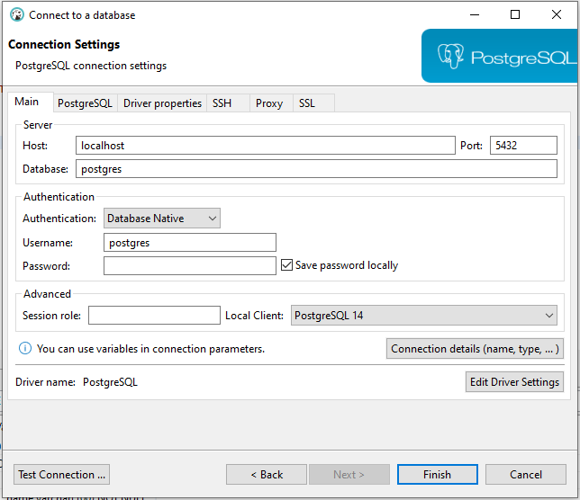
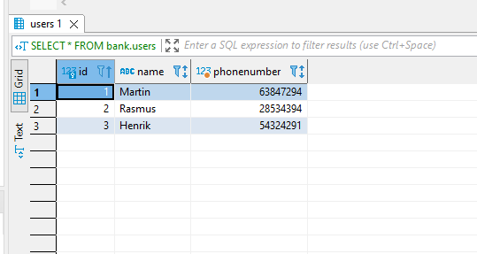

# Databases - Assignment 1

## Basic PostgreSQL

I denne assignment skal du vise basic forståelse af nogle kernekoncepter i at arbejde med Postgres.

Deriblandt arbejde med Docker og designe systemer ud fra ideen om at bruge virtual machines.

Du *kan* bruge Docker til at køre PostGres i et virtuelt miljø - beskriv fordelene ved at bruge virtuelle maskiner og CLI fremfor din egen.

### 1. Grundlæggende koncepter for Postgres.

PostgreSQL er en relationel database type, i modsætning til fx dokumentbaserede databaser.

Generelt bruger den samme syntaks som andre SQL databaser som vi tidligere har benyttet i skolen, med nogle enkelte undtagelser.

I denne opgave har jeg valgt at bruge DBeaver, som er et database administreringsværktøj.

#### Forbind til databasen

For at forbinde til databasen, skal man oprette en ny forbindelse i DBeaver.

Når denne forbindelse er oprettet, kan man lave et SQL script, hvor man kan derefter kan lave queries til databasen.

#### CRUD

Først laves et nyt skema:

    CREATE SCHEMA bank;

Derefter laves der en ny tabel:

    CREATE TABLE bank.users (
	    id	int PRIMARY KEY,
	    name varchar(100) NOT NULL
    )

Create:

    INSERT INTO bank.users (id, name) VALUES (1, 'Morten');

Read:

    SELECT * FROM bank.users;

Update:

    UPDATE bank.users SET name = 'Martin' WHERE id = 1;

Delete:

    DELETE FROM bank.users WHERE id = 1;

#### Modificering af tabel

Jeg vil nu gerne tilføje et tlf nummer til users

    ALTER TABLE bank.users ADD COLUMN phonenumber int;

Nu kan der så laves en bruger igen:

    INSERT INTO bank.users (id, name, phonenumber) VALUES (1, 'Martin', 67349834);

Eller tilføjes mange brugere på én gang:

    INSERT INTO 
        bank.users (id, name, phonenumber) 
    VALUES 
        (1, 'Martin', 67349834), 
        (2, 'Søren', 92348744),
        (3, 'Henrik', 25485938);

Eller redigeres i en allerede lavet bruger:

    UPDATE bank.users SET phonenumber = 27594727 WHERE id = 1;

#### Oversigt over tabellen:

Her ses et billede af hvad der kommer ud, når der laves en

    SELECT * FROM bank.users;

### 2. Kører PostgreSQL gennem Docker.

Det er også muligt at bruge Docker til at lave et virtuelt instans af postgres - det giver en række fordele.

- Ingen installationer lokalt på computeren.
- En virtuel container sikre at et 'image' kan køre på alle computere på tværs af styresystemer.
- Fremtidige opdateringer af forskelligt software kan ikke påvirke det virtuelle miljø.
- Det er langt hurtigere og mere effektivt at oprette et virtuelt billede fremfor at skulle lave en masse installationer lokalt på computeren.

#### Kommando for at oprette et virtuelt miljø

    docker run --name postgres-db -e POSTGRES_PASSWORD=psql-test -p 5432:5432 -d postgres-test

Herefter har vi adgang til et virtuelt instans af postgres.
